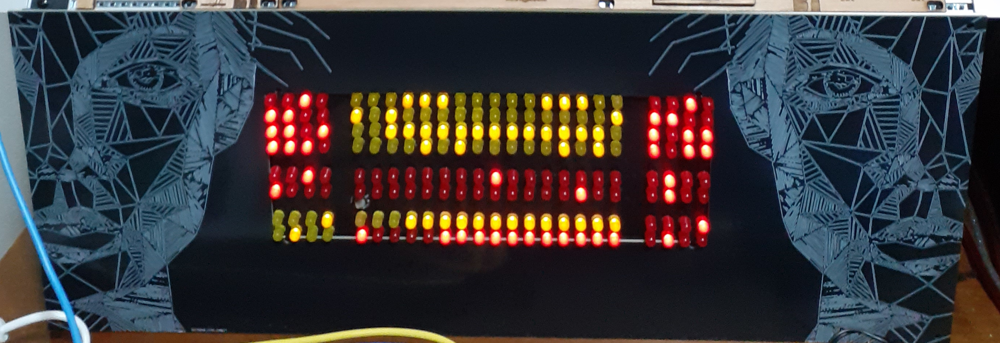
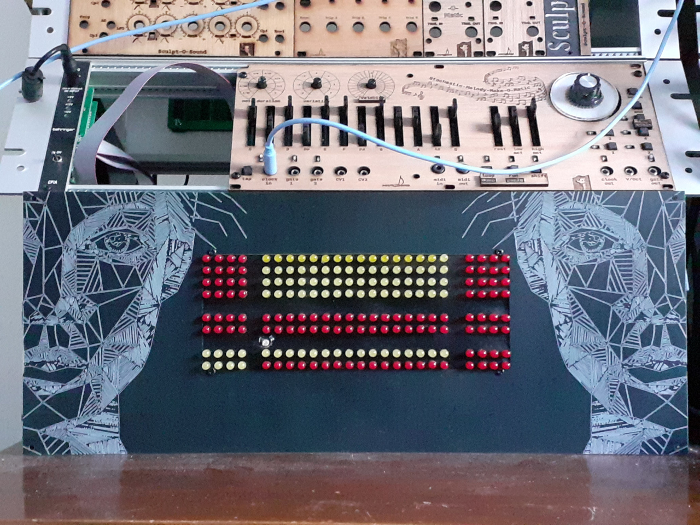
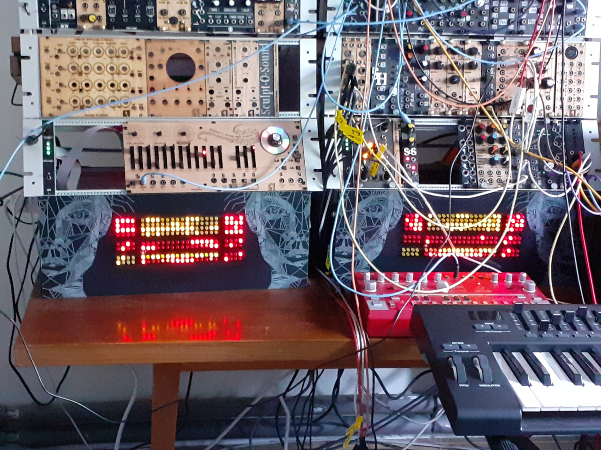
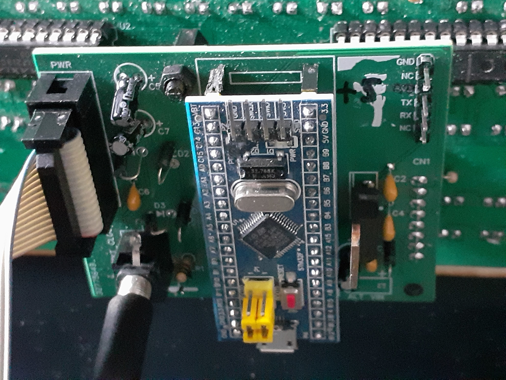
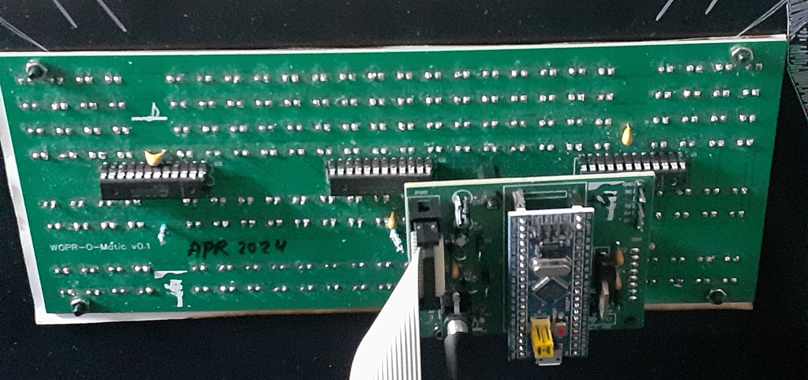

WOPR-O-Matic
-

This is WOPR-O-Matic by Sculpt-O-Sound.

It consists of a LED-board containing 192 LEDs and a small board that is piggy backed to the LED-board which contains the controling logic. The WOPR will adjust the brightness of the LEDs to the level of light in the room using an LDR. The patterns are defined and changed over time by an STM32F103 BluePill.

Note WOPR-O-Matic is shown here mounted in a panel with the face of Apollo, Greek God of Music from ancient times. The panel was added to be able to mount it in my 19 inch euro rack.

WOPR-O-Matic is meant as an adornment of my eurorack. It fills a gap in the bottom of the rack that is too small for conventional eurorack modules.

The speed of the pattern changes can be controlled via a clock-input (3.5 mm jack), here visible on the bottom left. If the clock is taken from the eurorack, the pattern changes can be synced to the music played on the rack. Each block of leds can switch between several algoritms and speeds. This is controlled via random numbers.

WOPR-O-Matic can be powered in several ways. Here it is powered using a flatcable from the backplane of my eurorack.

The STM32F103 BluePill controls the LEDs via three MAX7219 ICs.

You can see the 2 WOPRs in action here: https://www.youtube.com/watch?v=L203UwEdGJY

For demo videos of this and some of my other projects go to https://www.youtube.com/@zaphodb5361

For my music go to https://www.youtube.com/@josbouten
